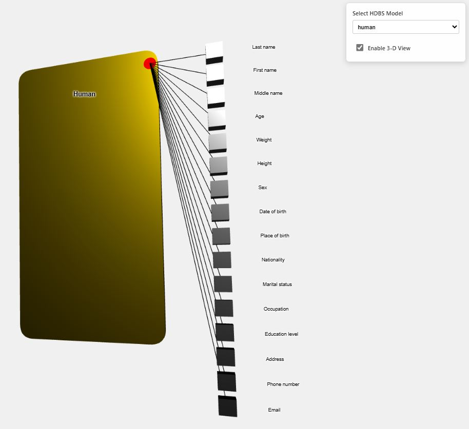

# Project Title: HDBS Graphic Simulator

## About The Project

This project provides an interactive visualization tool for **Hypergraph-Based Data Structures (HBDS)**. Built entirely with web technologies, it allows users to load, view, and manipulate complex data models in both 2D and 3D space directly in the browser.

### Live Demo

[Live Demo](https://arcazj.github.io/openbexi_hbds/index.html)



### Key Features:

* **Interactive 2D & 3D Views**: Seamlessly switch between a 2D pannable layout and a full 3D orbital view.
* **Dynamic Model Loading**: Load different HBDS models on-the-fly from external JSON files.
* **Direct Manipulation**: Drag and drop class entities to organize your diagram in 2D view.
* **Fallback Gracefully**: Automatically loads a default model if a specified one isn't found.

### Built With

* [![Three.js][Three.js]][Three.js-url]

---

## Getting Started

To get a local copy up and running, follow these simple steps.

### Prerequisites

This project requires no special installations or package managers like npm. You only need a modern web browser and a local web server to handle ES module imports.

### Installation

1.  **Clone the repo**
    ```sh
    git clone https://github.com/arcazj/openbexi_hbds.git
    ```
2.  **Navigate to the project directory**
    ```sh
    cd openbexi_hbds
    ```
3.  **Run a local web server**
    Because the simulator uses ES Modules (`import`), you must serve the `index.html` file. You cannot open it directly via the `file://` protocol. A simple built-in Python server works perfectly:

    * For **Python 3**:
        ```sh
        python3 -m http.server
        ```
    * For **Python 2**:
        ```sh
        python -m SimpleHTTPServer
        ```
4.  **Open the simulator**
    Navigate to `http://localhost:8000` in your web browser.

---

## Usage

* **Select a Model**: Use the dropdown menu on the top right to load different HBDS models.
* **Toggle 3D View**: Check the "Enable 3-D View" box to switch from the default 2D layout to a fully rotatable 3D view.
* **Navigate the Scene**:
    * **Pan**: Right-click and drag (or two-finger drag on a trackpad).
    * **Zoom**: Use the mouse scroll wheel.
    * **Rotate** (in 3D view only): Left-click and drag.
* **Drag Classes**: In 2D view, left-click and drag any class rectangle to move it around the canvas.

To add new models, simply place your `.json` files in the `/models` directory and they will appear in the dropdown.

---

## Roadmap

* [ ] Add support for hyperclasses.
* [ ] Add support for defining relationships between hyperclasses and classes.
* [ ] Implement a search or filter feature for attributes.
* [ ] Allow real-time editing of class properties from the UI.

See the [open issues](https://github.com/arcazj/openbexi_hbds/issues) for a full list of proposed features (and known issues).

---

## Contributing

Contributions are what make the open-source community such an amazing place to learn, inspire, and create. Any contributions you make are **greatly appreciated**.

If you have a suggestion that would make this better, please fork the repo and create a pull request. You can also simply open an issue with the tag "enhancement".

1.  Fork the Project
2.  Create your Feature Branch (`git checkout -b feature/AmazingFeature`)
3.  Commit your Changes (`git commit -m 'Add some AmazingFeature'`)
4.  Push to the Branch (`git push origin feature/AmazingFeature`)
5.  Open a Pull Request

---

## License

Distributed under the MIT License. See `LICENSE.txt` for more information.

---
## Acknowledgments

* [Three.js](https://threejs.org/)


<!-- MARKDOWN LINKS & IMAGES -->
[Three.js]: https://img.shields.io/badge/three.js-000000?style=for-the-badge&logo=three.js&logoColor=white
[Three.js-url]: https://threejs.org/
