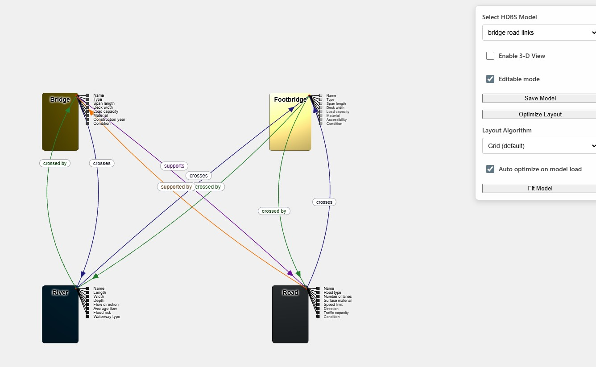

# HBDS Graphic Simulator

An interactive browser-based simulator for **Hypergraph-Based Data Structures (HBDS)**. The app renders HBDS models as editable 2D diagrams and optional 3-D scenes using Three.js.

[Live demo for viewing models](https://arcazj.github.io/openbexi_hbds/index.html)



[Live demo for building a new HBDS model](https://arcazj.github.io/openbexi_hbds/test_dynamic_hbds_layout.html)


## Documentation

This README is the main entry point for setup, features, server mode, API endpoints, usage, and project structure. Other project Markdown files:

* [Test_and_Integration.md](Test_and_Integration.md) - authoritative validation and integration checklist, including smoke tests, model validators, JavaScript syntax checks, optional Maven tests, manual workflows, and expected pass/fail reporting.
* [Prompt4HDBS_graphi_ simulator.md](Prompt4HDBS_graphi_%20simulator.md) - reverse-engineering and phased implementation prompt for covering the full HBDS Graphic Simulator capability set.

Generated preview caches may contain third-party Markdown under hidden directories such as `.codex_previews/`; those files are not project documentation.

## Recent Updates

This week the project added a larger local-server workflow and collaboration surface:

* **Application shell**: `index.html` now provides Models, Edit, Tests, and Help views from one menu.
* **Server connection indicator**: the menu bar shows connected, connecting, and not connected states while polling the local Python server.
* **Readable API documentation**: `GET /api/docs` renders browser-readable API documentation from the OpenAPI spec.
* **OpenAPI specification**: `GET /api/openapi.json` remains available for tools and clients that need machine-readable API metadata.
* **Automatic manifests**: `models/models_manifest.json` and `test_models/test_models_manifest.json` are regenerated every time `server.py` starts.
* **Scoped test-model saving**: saves from the Tests workspace use `./test_models/`.
* **Model operations API**: element-level operations can be applied through the server with revision checks and automatic merge for simple non-conflicting stale edits.
* **Live collaboration**: Edit and Tests views publish live draft state over Server-Sent Events and show other users in a floating collaboration panel.
* **Collaboration conflict choices**: users can choose `Merge Both`, `Use Theirs`, or `Keep Mine` before saving over another active edit.
* **Collaboration preview**: the floating panel is draggable, resizable, zoomable, and shows the selected user's diagram without taking over the canvas.
* **Model tree sidebar**: Edit and Tests now include a collapsible searchable tree for classes, hyperclasses, attributes, and links.
* **Modeling productivity tools**: selected nodes can be duplicated, copied, pasted, exported as a subgraph, and edited with bulk attribute and link route helpers.
* **Detailed remote changes**: `Remote changes vs mine` reports class/hyperclass movement, attributes, links, rendering properties, route changes, and per-change timestamps.
* **Per-change timestamp history**: older remote changes keep their first-seen time when later remote updates arrive.
* **Models view cleanup**: Models mode is read-focused and keeps model selection, 3-D view, fit, zoom, and overview behavior without edit/save controls.
* **Editing cleanup**: attribute deletion has a dedicated button, and selected link deletion now uses explicit link text.
* **Regression coverage**: the smoke suite now checks health, OpenAPI, manifests, drafts, events, presence, scoped saves, operation merge, stale conflicts, and server shutdown.

## Features

* **2-D and 3-D views**: switch between an editable 2-D canvas and an orbitable 3-D view.
* **Models, Edit, and Tests workspaces**: use Models for read-focused viewing, Edit for model editing, and Tests for regression/test models.
* **Class, hyperclass, attribute, and link rendering**: visualize nested hyperclasses, attributes, and relationships between classes.
* **Direct manipulation**: drag classes and hyperclasses in editable mode.
* **Layout tools**: fit models to the canvas and optimize placement with `grid`, `hierarchy`, or `radial` layout algorithms where editing is enabled.
* **Overview minimap**: navigate larger models with the built-in model overview.
* **Model tree navigation**: search, inspect, and select classes, hyperclasses, attributes, and links from a compact tree sidebar in editable workspaces.
* **Productivity editing**: duplicate or copy/paste selected nodes, add multiple attributes at once, reorder attributes, swap link endpoints, and apply route presets.
* **Selected subgraph export**: download JSON for selected nodes plus links whose endpoints are included.
* **Model export and server save**: download JSON locally or save through the Python server when connected.
* **Live collaboration UI**: see other connected users, inspect their live draft, review remote differences, and choose how to resolve save conflicts.
* **Local model API**: load, save, draft, stream, and merge model changes through the Python backend.
* **Dynamic layout test page**: use `test_dynamic_hbds_layout.html` to add, delete, link, test, and export model elements during development.

## Built With

* [Three.js](https://threejs.org/)
* Plain HTML, CSS, and JavaScript ES modules
* Python standard library server for local API mode

## Getting Started

The simulator must be served from a local web server. Opening `index.html` directly with the `file://` protocol will not work reliably because the app uses ES modules and loads JSON model files.

### Prerequisites

Use a modern browser and one of the following local server options:

* Python 3
* Any static file server that serves this repository root

### Run Static Mode

```sh
git clone https://github.com/arcazj/openbexi_hbds.git
cd openbexi_hbds
python -m http.server 8000
```

Then open:

* Main shell: `http://localhost:8000/`
* Dynamic layout test page: `http://localhost:8000/test_dynamic_hbds_layout.html`

On systems where `python` points to Python 2, use:

```sh
python3 -m http.server 8000
```

Static mode can view and edit in the browser, but server save/load, API docs, connection status, and collaboration require `server.py`.

### Run Connected Server Mode

The connected mode uses the included Python server. It serves the UI, refreshes manifests at startup, and exposes model, documentation, event, draft, and operation APIs.

```sh
python server.py --port 8010
```

On Windows with the Python launcher:

```sh
py server.py --port 8010
```

Then open:

```text
http://127.0.0.1:8010/index.html
```

When overwriting an existing model, the server writes a timestamped backup under the matching `.backups/` directory before replacing the file.

## Workspaces

The main shell has four menu entries:

* **Models**: read-focused model viewer. It keeps model selection, 3-D toggle, fit, zoom, and overview behavior. Save and layout-edit controls are hidden.
* **Edit**: editable workspace for files from `models/`.
* **Tests**: editable workspace for files from `test_models/`; server saves stay under `./test_models/`.
* **Help**: project help, API documentation links, and keyboard help.

## Collaboration

Live collaboration is available in Edit and Tests when the Python server is running.

* Each browser tab or external client can publish live draft state.
* The floating panel appears only when another user is connected to the same model and has relevant state.
* The panel shows `Live Collaboration`, `Others' View`, the number of connected users for the current model, and a collaborator dropdown.
* The panel can be moved, resized, and zoomed.
* `Remote changes vs mine` is scrollable and reports detailed property-level differences.
* Each remote change keeps its first-seen timestamp; later remote updates do not rewrite older change times.
* Save conflict actions:
  * `Merge Both` combines non-conflicting changes.
  * `Use Theirs` applies the selected remote diagram.
  * `Keep Mine` keeps the local diagram and saves it.

The current merge support handles simple element-level, non-conflicting edits. More complex simultaneous edits can still require manual choice.

## API

Connected mode exposes these main endpoints:

* `GET /api/health` - connection status for the menu bar.
* `GET /api/models` - list JSON models in `models/`.
* `GET /api/models/{modelName}` - load one model from `models/`.
* `POST /api/models/{modelName}` - validate and save one model into `models/`.
* `POST /api/models/{modelName}/ops` - apply element-level model operations with revision checks.
* `GET /api/models/{modelName}/drafts` - list live drafts for one model.
* `POST /api/models/{modelName}/drafts/{clientId}` - publish one client's live model draft.
* `DELETE /api/models/{modelName}/drafts/{clientId}` - clear one client's live draft.
* `GET /api/model-files/{scope}/{modelName}` - load a model from `models` or `test_models`.
* `POST /api/model-files/{scope}/{modelName}` - save a scoped model file; scoped saving is enabled for `test_models`.
* `GET /api/drafts/{scope}/{modelName}` - list scoped live drafts.
* `POST /api/drafts/{scope}/{modelName}/clients/{clientId}` - publish a scoped live draft.
* `DELETE /api/drafts/{scope}/{modelName}/clients/{clientId}` - clear a scoped live draft.
* `GET /api/events` - Server-Sent Events stream for presence, model updates, draft updates, and draft clears.
* `GET /api/docs` - browser-readable API documentation.
* `GET /api/openapi.json` - machine-readable OpenAPI specification.

## Models And Manifests

Models live in two directories:

* `models/` - standard/sample models.
* `test_models/` - regression and test models used by the Tests workspace.

The Python server automatically regenerates both manifests on startup:

* `models/models_manifest.json`
* `test_models/test_models_manifest.json`

Manifest entries are built from the `.json` files present in each directory. Hidden files and manifest files are skipped. For each model:

* `value` is the relative path, for example `models/bridge_road_links.json`.
* `label` is derived from the filename without `.json`, with `_` and `-` replaced by spaces.
* `description` matches the label.

When running with `server.py`, adding or removing a model file only requires restarting the server to refresh the manifests.

## Usage

* **Select a HBDS Model** to load a sample or test model.
* **Enable 3-D View** to rotate the scene with the mouse.
* **Fit Model** recenters and zooms the camera around the current model.
* **Zoom** with the mouse wheel or trackpad.
* **Pan** with right-click drag or two-finger trackpad drag.
* **Rotate** in 3-D mode with left-click drag.
* **Move nodes** in editable 2-D mode by dragging a class or hyperclass.
* **Add elements** in Edit or Tests with Hyperclass, Class, Attribute, and Link controls.
* **Use the Model Tree** in Edit or Tests to search by name, ID, type, link endpoint, or attribute text. Click tree rows to select canvas elements; Shift-click node rows to build a multi-selection.
* **Use Productivity tools** to duplicate or copy/paste selected classes and hyperclasses. Pasted nodes get new IDs and are offset from the originals.
* **Bulk Attributes** accepts one attribute name per line and rejects duplicate names before applying changes.
* **Move Attr Up** and **Move Attr Down** reorder the selected attribute while preserving its data and rendering fields.
* **Swap Link** reverses the selected link source and target.
* **Route** presets update selected link routing with `auto`, `horizontal`, `vertical`, `direct`, or `orthogonal`.
* **Export Selected** downloads a JSON subgraph containing selected nodes, descendants of selected hyperclasses, and links where both endpoints are included.
* **Delete Attribute** removes the selected attribute without deleting its owning class.
* **Delete selected link** removes the selected link when a link is selected.
* **Save** writes to the active workspace in connected mode or downloads JSON in browser-only mode.

## Testing

Run the server regression smoke test:

```sh
python scripts/smoke_server.py
```

On Windows with the Python launcher:

```sh
py scripts/smoke_server.py
```

The smoke test starts a temporary server port and verifies:

* health and disconnected states
* OpenAPI generation
* automatic manifest generation
* model list/load/save
* revision conflict handling
* Server-Sent Events
* presence
* live draft state
* scoped `test_models` save/load
* operation updates
* stale operation automatic merge
* stale operation and stale save conflicts

Optional model checks:

```sh
python tools/validate_manifests.py
python tools/lint_model_naming.py
```

Run productivity helper coverage:

```sh
node scripts/productivity_helpers_test.mjs
```

Run JavaScript syntax checks for the editable workspace and helper modules:

```sh
Get-Content -Raw js/test_dynamic_hbds_layout.js | node --input-type=module --check
Get-Content -Raw js/hbds_model_productivity.js | node --input-type=module --check
```

On systems where Maven is installed, Java tests can be run with:

```sh
mvn test
```

This repository currently does not include a Maven wrapper, so `mvn` must be installed separately.

## Project Structure

```text
.
|-- css/                           # Application styles
|-- icons/                         # Shell and menu icons
|-- images/                        # Model/image assets
|-- js/                            # HBDS rendering, model, layout, server, and collaboration modules
|-- js/hbds_model_productivity.js  # Pure helpers for duplicate, paste, route preset, and subgraph export workflows
|-- models/                        # Standard/sample HBDS JSON models
|-- test_models/                   # Regression and test HBDS JSON models
|-- pictures/                      # README and project images
|-- scripts/smoke_server.py        # Server regression smoke suite
|-- scripts/productivity_helpers_test.mjs # Node checks for productivity helper behavior
|-- tools/                         # Manifest and naming validation helpers
|-- index.html                     # Main shell: Models, Edit, Tests, Help
|-- index_models.html              # Models viewer
|-- test_dynamic_hbds_layout.html  # Editable dynamic layout/test UI
|-- server.py                      # Local UI/API/collaboration server
`-- pom.xml                        # Java/Maven scaffold, not required for the browser app
```

## Roadmap

* [ ] Add richer tree actions such as drag-to-reparent and inline rename.
* [ ] Expand hyperclass editing workflows.
* [ ] Add richer relationship editing between hyperclasses and classes.
* [ ] Add stronger visual conflict resolution for complex simultaneous edits.
* [ ] Add undo/redo coverage for productivity operations.
* [ ] Add a committed Maven wrapper so Java tests can run without a global Maven install.

See the [open issues](https://github.com/arcazj/openbexi_hbds/issues) for proposed features and known issues.

## Contributing

1. Fork the project.
2. Create a feature branch: `git checkout -b feature/my-change`.
3. Commit your changes: `git commit -m "Describe the change"`.
4. Push the branch: `git push origin feature/my-change`.
5. Open a pull request.

## License

Distributed under the MIT License. See [LICENSE.txt](LICENSE.txt) for details.
