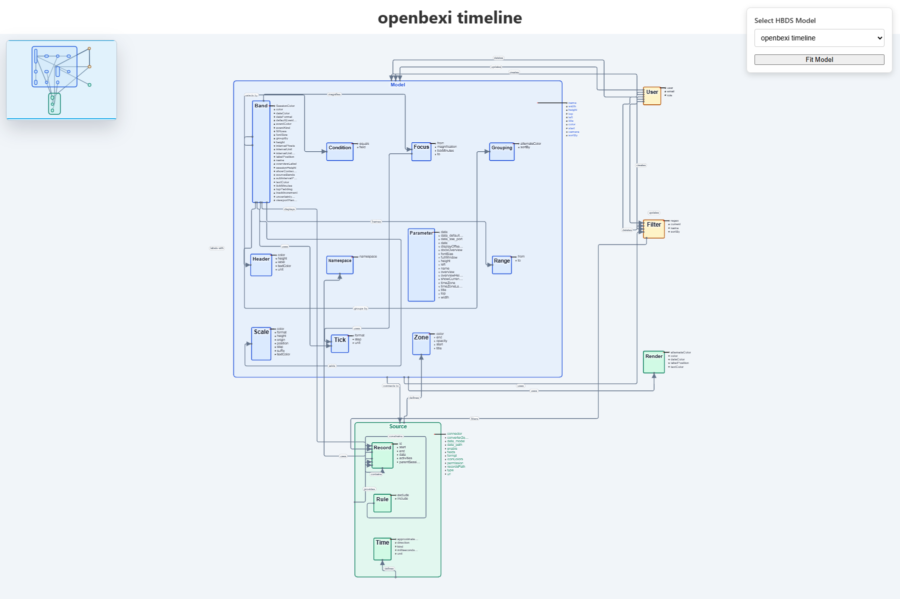
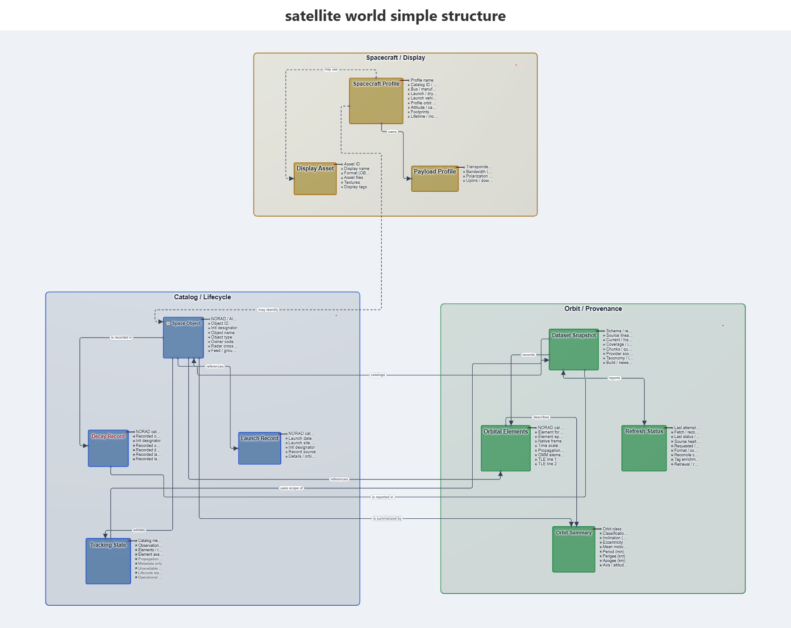
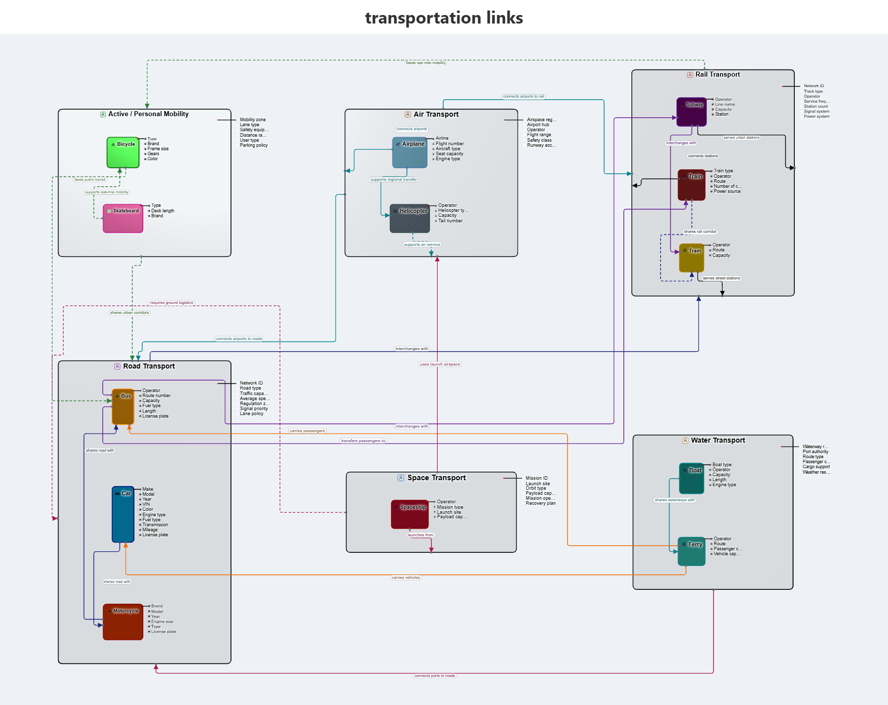

# HBDS Graphic Simulator

Build and explore **Hypergraph-Based Data Structures (HBDS)** in your browser.
Model classes, nested hyperclasses, attributes, and relationships in 2-D or 3-D.

**Version 2.6.2** · [Live demo](https://arcazj.github.io/openbexi_hbds/index.html) · [Release notes](CHANGELOG.md)

## Examples

Screenshots show the Models view in version 2.6.2.

### OpenBEXI Timeline

The Timeline domain model connects users, filters, presentation models, sources,
records, namespaces, and shared rendering. [Model and source mapping](doc/OPENBEXI_TIMELINE_MODEL.md)
and [complete application recreation prompt](prompts/openbexi_timeline_prompt.MD).



### Satellite World Simple Structure

A source-audited view of space objects, historical decay records, orbital data,
and dataset provenance. [Model and source mapping](doc/SATELLITE_MODEL_SOURCES.md).



### Transportation Links

Classes and relationships in a transportation network.
[Open the model JSON](models/transportation_links.json).



## Features

- **Models, Edit, and Tests:** browse examples, edit models, and run visual scenarios.
- **Automatic layout:** Grid, Radial, and Hierarchy with nested groups, readable names, and routed links.
- **Link separation:** **Separates links** is on by default; turn it off to use legacy spacing.
- **Attribute columns:** one connector to the first attribute, larger text, and compact spacing adjustable in the 2D attribute inspector.
- **Editing and export:** search the model tree, drag nodes, copy/paste, edit attributes, and export JSON or diagram images.
- **AI support:** generate, validate, and improve models with reviewed changes, selective apply, and rollback. Includes a manual copy/paste workflow.
- **Local collaboration:** share live drafts, review differences, and merge compatible edits through the Python server.
- **Optional semantics:** object instances, inheritance, memberships, and functor queries.

## Quick start

Requires Python 3.9+ and a modern browser. On Windows, use `py` in place of `python3`.

```sh
git clone https://github.com/arcazj/openbexi_hbds.git
cd openbexi_hbds
python3 server.py --port 8010
```

Open **http://127.0.0.1:8010/**. Choose **Models** to browse, **Edit** to work with
`models/`, or **Tests** for `test_models/`. Use **Fit Model**, the mouse wheel to
zoom, and right-click drag to pan. **Help** contains the full user guide.

The server saves models with revision checks and timestamped backups. It binds
to localhost and is intended for a trusted workstation. For viewing and local
JSON downloads without API writes or collaboration, add `--static-only`.

See [server and AI setup](doc/SERVER_AND_AI.md) for credentials, configuration,
collaboration, and API access. Serve the app through `server.py`; opening HTML
files directly does not reliably support its modules and model loading.

## Documentation

- [Modeling tutorial](doc/HBDS_MODELING_TUTORIAL.md) and [HBDS glossary](doc/HBDS_GLOSSARY.md)
- [Layout and optimization](doc/LAYOUT_OPTIMIZATION.md)
- [OpenBEXI Timeline model](doc/OPENBEXI_TIMELINE_MODEL.md) and [recreation prompt](prompts/openbexi_timeline_prompt.MD)
- [Diagram contract](doc/HBDS_STRUCTURAL_DIAGRAM_PROFILE_V1.md) and [JSON schemas](schemas/README.md)
- [Documentation catalog](doc/README.md) and [proposed functor API](openapi_docs/README.md)
- [Testing and integration](Test_and_Integration.md), [roadmap](Roadmap.md), and [open issues](https://github.com/arcazj/openbexi_hbds/issues)

## Development

The browser app uses Three.js, plain JavaScript, HTML, and CSS; the server uses
Python's standard library. Run checks in an isolated copy with Node.js and
Edge or Chrome installed:

```sh
python3 -B scripts/check_project.py
```

Use `--skip-browser` for helper/server checks. Browser checks require access to
the Three.js CDN; AI provider tests use mocks. See the [testing guide](Test_and_Integration.md)
for individual suites and the optional Java/Maven scaffold. Contributions are
welcome through pull requests with relevant validation results.

## License

**Personal noncommercial use, student and educator activities, academic and
other noncommercial research, and qualifying charities and nonprofits are free.**
Business use requires a paid commercial agreement unless it qualifies for an
exemption under the **Commercial and Exempt Use License**.

See [LICENSE.txt](LICENSE.txt) and [commercial licensing](COMMERCIAL_LICENSE.md).
Licensing contact: [openbexi@gmail.com](mailto:openbexi@gmail.com).
Earlier MIT permissions and third-party terms remain in effect for their
respective material: [MIT notice](LICENSES/MIT-legacy.txt), [third-party notices](THIRD_PARTY_NOTICES.md).
